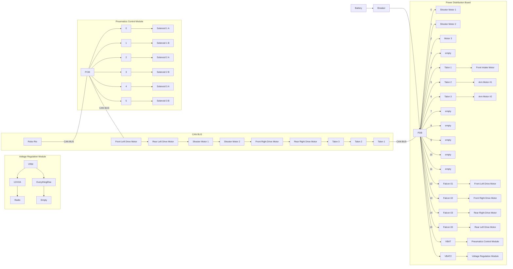

```mermaid

flowchart LR
Battery--> Breaker --> PDB

    subgraph Power Distribution Board
    PDB --0--> A[Shooter Motor 1]
    PDB --1--> B[Shooter Motor 2]
    PDB --2--> C[Motor 3]
    PDB --3--> D[empty]
    PDB --4--> E[Talon 1] --> E1[Front Intake Motor]
    PDB --5--> F[Talon 2] --> F1[Arm Motor #1]
    PDB --6--> G[Talon 3] --> G1[Arm Motor #2]
    PDB --7--> H[empty]
    PDB --8--> I[empty]
    PDB --9--> J[empty]
    PDB --10-->K[empty]
    PDB --11-->L[empty]
    PDB --12-->M[Falcon 01] --> M1[Front Left Drive Motor]
    PDB --13-->N[Falcon 02] --> N1[Front Right Drive Motor]
    PDB --14-->O[Falcon 03] --> O1[Rear Right Drive Motor]
    PDB --15-->P[Falcon 00] --> P1[Rear Left Drive Motor]
    PDB -->VBAT-->Q[Pneumatics Control Module]
    PDB -->VBAT2-->R[Voltage Regulation Module]
end 
subgraph Pnuematics Control Module
PCM -->0-->a[Solenoid 1 A]
PCM -->1-->b[Solenoid 1 B]
PCM -->2-->c[Solenoid 2 A]
PCM -->3-->d[Solenoid 2 B]
PCM -->4-->e[Solenoid 3 A]
PCM -->5-->f[Solenoid 3 B]
end
subgraph Voltage Regulation Module
VRM -->12V/2A-->aaa[Radio]
VRM -->EverythingElse-->bbb[Empty]
end
    subgraph CAN BUS
    CAN.1[Robo Rio]
    CAN.3[Front Left Drive Motor]
    CAN.4[Rear Left Drive Motor]
    CAN.5[Shooter Motor 1]
    CAN.6[Shooter Motor 2]
    CAN.7[Front Right Drive Motor]
    CAN.8[Rear Right Drive Motor]
    CAN.9[Talon 3]
    CAN.10[Talon 2]
    CAN.11[Talon 1]
CAN.1 --CAN BUS--- PCM --CAN BUS--- CAN.3 --> CAN.4 --> CAN.5 --> CAN.6 --> CAN.7 --> CAN.8 --> CAN.9 --> CAN.10 --> CAN.11 --CAN BUS--- PDB
end
```